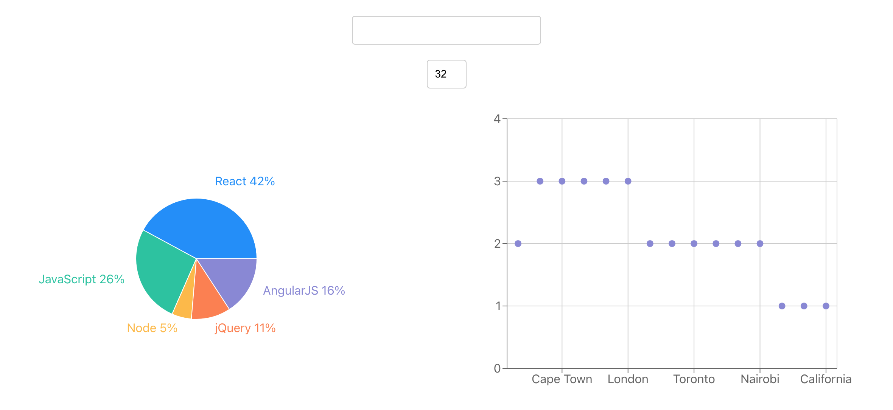
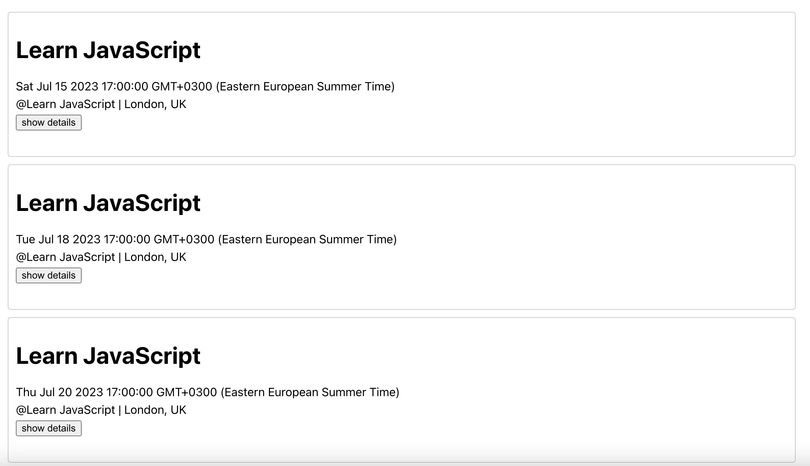
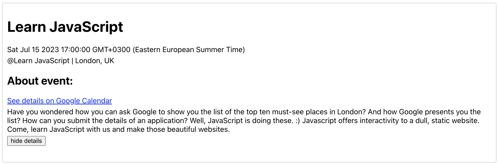

# Meet

Meet is a React application that allows users to search for events, view event details, and visualize the number of upcoming events in each city. It integrates with the Google Calendar API to retrieve event data.

## Demo App

You can see a demo app [here](https://leapapadopoulos.github.io/meet/)

## App Screenshots

## Installation and Setup

1. Clone the repository.
2. Run `npm install` to install the dependencies.
3. Run `npm start` to start the application.
4. Navigate to `http://localhost:3000` in your browser.

## Features

### Feature 1: Filter events by city

As a user, I should be able to filter events by city, so that I can see the list of events that take place in that city.

- Scenario 1: When the user hasn't searched for a city, show upcoming events from all cities.
- Scenario 2: User should see a list of suggestions when they search for a city.
- Scenario 3: User can select a city from the suggested list and receive a list of upcoming events in that city.

### Feature 2: Show/hide event details

As a user, I should be able to show/hide an event's details, so that I can view or hide the information I need.

- Scenario 1: An event element is collapsed by default.
- Scenario 2: User can expand an event to see its details.
- Scenario 3: User can collapse an event to hide its details.

### Feature 3: Specify the number of events

As a user, I should be able to specify the number of events I want to see, so that I can control the amount of information I see on the page.

- Scenario 1: When the user hasn't specified a number, 32 is the default number.
- Scenario 2: User can change the number of events they want to see.

### Feature 4: Use the app when offline

As a user, I should be able to use the app when offline, so that I can continue to access cached data and stay productive.

- Scenario 1: Show cached data when there's no internet connection.
- Scenario 2: Show an error when the user changes the settings (city, time range) without an internet connection.

### Feature 5: Data visualization

As a user, I should be able to view a chart with the number of upcoming events in each city, so that I can easily identify the most active cities and plan my schedule accordingly.

- Scenario 1: Show a chart with the number of upcoming events in each city.

## Technologies Used

- React
- Google Calendar API
- Recharts
- Axios
- AWS Lambda 
- Serverless Functions
- OAuth2

## Dependencies

The following dependencies are required to run the application:

- @testing-library/jest-dom
- @testing-library/react
- @testing-library/user-event
- atatus-spa
- axios
- fsevents
- googleapis
- nprogress
- react
- react-dom
- react-scripts
- recharts
- semver
- watchman
- web-vitals
- workbox-background-sync
- workbox-broadcast-update
- workbox-cacheable-response
- workbox-core
- workbox-expiration
- workbox-google-analytics
- workbox-navigation-preload
- workbox-precaching
- workbox-range-requests
- workbox-routing
- workbox-strategies
- workbox-streams

## Development Dependencies

The following dev dependencies are required for development purposes:

- @wojtekmaj/enzyme-adapter-react-17
- enzyme
- gh-pages
- jest-cucumber
- puppeteer

## Serverless:

- Will be used to send authentication/Authorization requests to Gmail, and eventually receive the access token
- Use this access token to retrieve events from the Google Calendar API and send them back to the react meet app (to display them over there)

## Contributing

Contributions are welcome! If you'd like to contribute to the project, please follow these steps:

1. Fork the repository.
2. Create a new branch.
3. Make your changes and commit them.
4. Push your changes to your forked repository.
5. Submit a pull request.

## License

This project is licensed under the MIT License. See the [LICENSE](LICENSE) file for more details.
